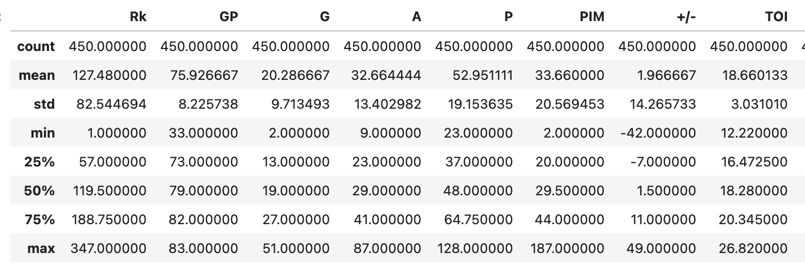
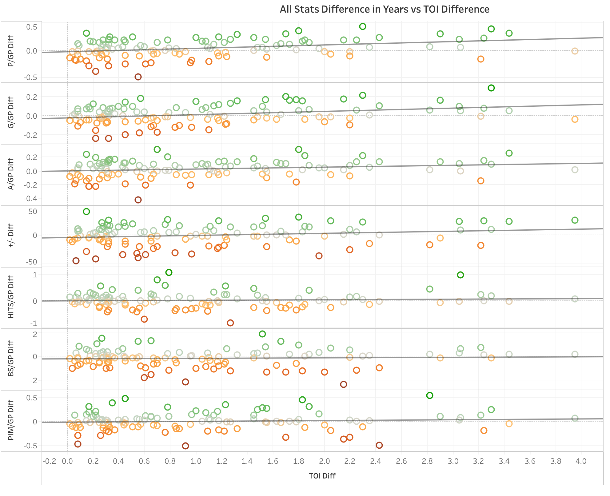
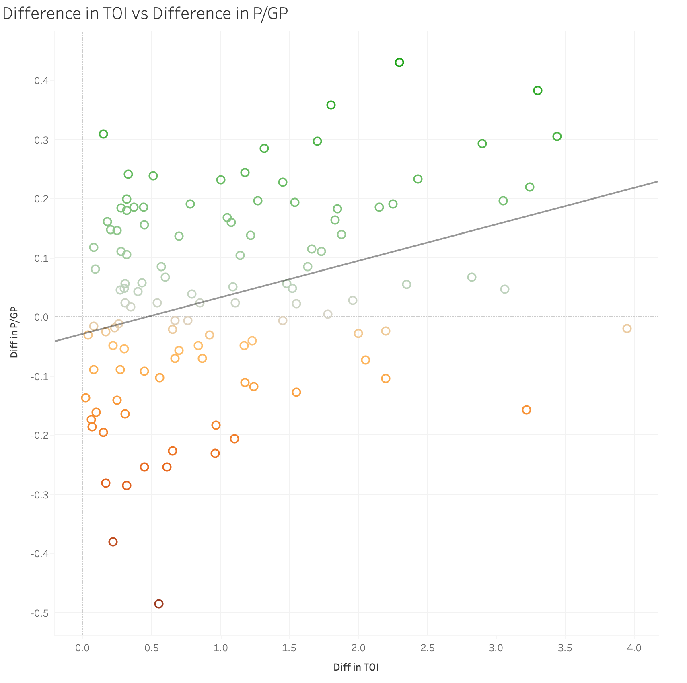
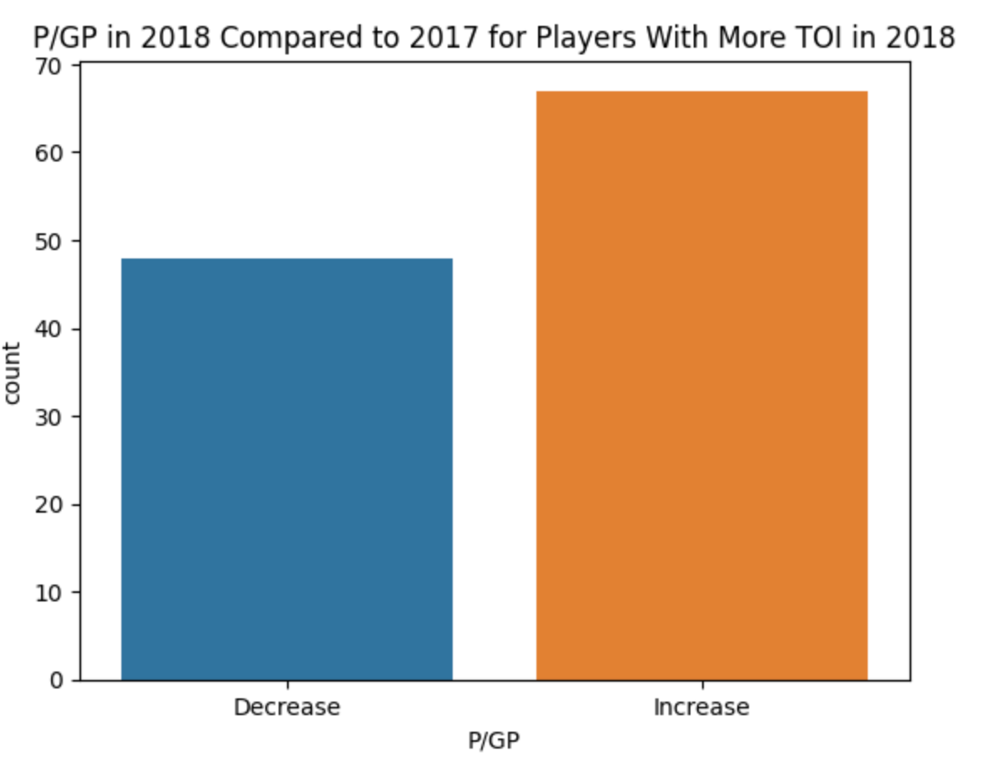

# Final Report Group 22

## Introduction

Our project has been a data analysis on top scoring players of the 2017 and 2018 NHL seasons. We looked at all the statistics of the top 250 players in points from the 2017 NHL season, and the top 300 players in points from the 2018 NHL season. We kept those players who were in the top 250 from 2017 as well as the top 300 from 2018 and that left us with 225 players to work with for our data set. Due to some of us having a background in hockey, this was an amusing data set for us to have formed and analyzing it made it feel like a lot less work when we had some sort of interest in the topic. The project was simply to see whether there were correlations between certain statistics and others or between succesive NHL seasons for the leagues best players.

---

## Exploratory Data Analysis

From our exploratory data analysis, it can be seen that between both years for the top 225 NHL players that remained in the data set, the average points a player had was 53 in 76 games played. That is not even a point per game and what is very interesting about that is how far spread the points are from the minimum to the maximum of those 225 players in the two seasons played. The lowest amount of points any player had that made that top 225 between the two years was 23 points, a little over half of the average. However, the highest anybody had was 128 points! Almost 2.5 times the mean! This speaks to the large skill gap even amongst the players in the most talented hockey league in the world.

---

## **Ricky Doucette**

### Does an increase in time on ice per game for a succesive season significantly increase an NHL player's overall statistics in that following season?

For all the players who had more TOI in 2018 compared to 2017, this first image shows the difference in some of their most important offensive and defensive statistics between seasons compared to the increase in TOI they received in 2018. From the looks of it, the increase in TOI had no impact on their defensive performance statistically. An increase in TOI does seem to have somewhat of a positively linear trend however with their offensive statistics. Most noticebly, players tend to produce more P/GP as the change in their TOI increases between seasons.

As shown below, overall more players had an increase in P/GP rather than a decrease when their TOI was increased in a successive season

From this analysis, we can conclude that an increase in a players average time on ice per game in a following season does not effect their defensive statistics, but it does effect their offensive statistics. Primarily their points per game played sees an increase when they receive more TOI.

---

## **Renat Rezyapov**

---

## **Ryan Tschritter**

## Summary

