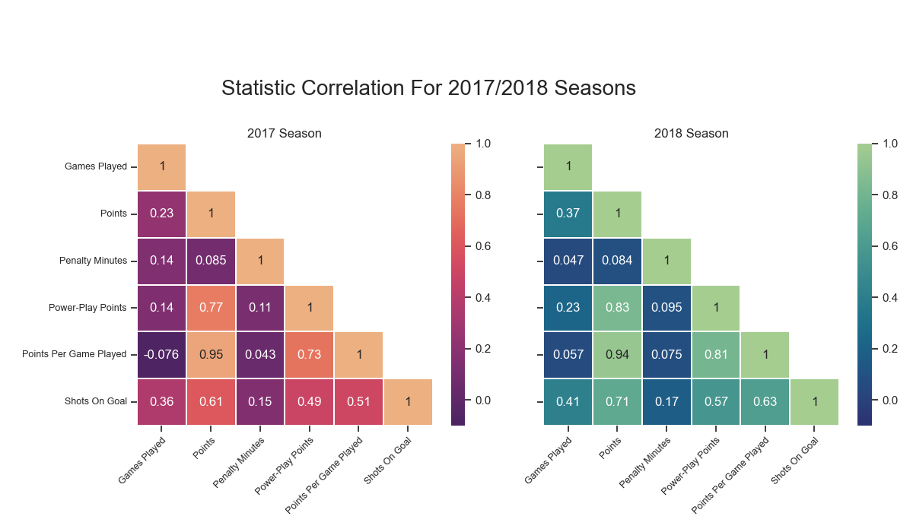
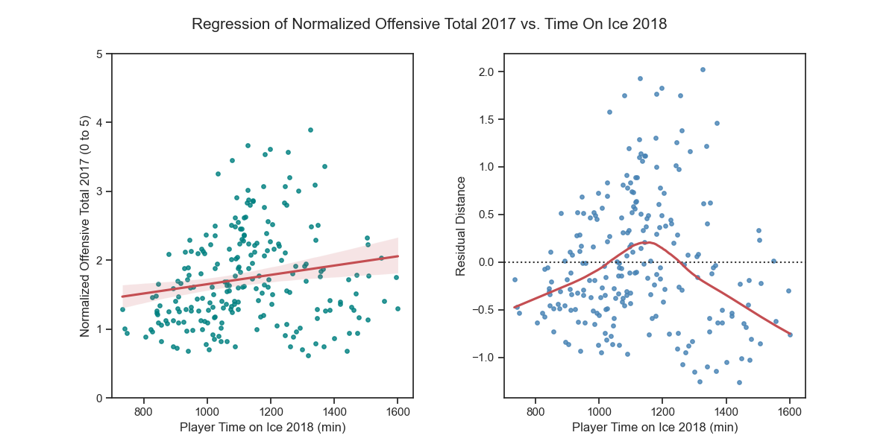

# Final Report Group 22

## Introduction

Our project has been a data analysis on the top scoring players of the 2017 and 2018 NHL seasons. We looked at all the statistics of the top 250 players in points from the 2017 NHL season, and the top 300 players in points from the 2018 NHL season. We kept those players who were in the top 250 from 2017 as well as the top 300 from 2018 and that left us with 225 players to work with for our data set. Due to some of us having a background in hockey, this was an amusing data set for us to have formed and analyzing it made it feel like a lot less work when we had some sort of interest in the topic. The project was simply to see whether there were correlations between certain statistics and others or between succesive NHL seasons for the league's best players.

---

## Exploratory Data Analysis

From our exploratory data analysis, it can be seen that between both years for the top 225 NHL players that remained in the data set, the average points a player had was 53 in 76 games played. That is not even a point per game. What is very interesting about that is how far spread the points are from the minimum to the maximum of those 225 players in the two seasons played. The lowest amount of points any player had that made that top 225 between the two years was 23 points, less than half of the average. However, the highest anybody had was 128 points! Almost 2.5 times the mean! This speaks to the large skill gap even amongst the top players in the most talented hockey league in the world.

We also wanted to explore the relationship between the goals scored in each season and time on ice. We created a facet plot that showed the relationship in both the 2017 season and 2018 season shown below. From this figure we can conclude that there is a negative or no correlation between the number of goals a player scores, and the time their given/spend on the ice.

---

## **Ricky Doucette**

### Does an increase in time on ice per game for a succesive season significantly increase an NHL player's overall statistics in that following season?

For all the players who had more TOI in 2018 compared to 2017, this first image shows the difference in some of their most important offensive and defensive statistics between seasons compared to the increase in TOI they received in 2018. From the looks of it, the increase in TOI had no impact on their defensive performance statistically. An increase in TOI does seem to have somewhat of a positively linear trend however with their offensive statistics. Most noticebly, players tend to produce more P/GP as the change in their TOI increases between seasons.

As shown below, overall more players had an increase in P/GP rather than a decrease when their TOI was increased in a successive season

From this analysis, we can conclude that an increase in a players average time on ice per game in a following season does not effect their defensive statistics, but it does effect their offensive statistics. Primarily their points per game played sees an increase when they receive more TOI.

---

## **Renat Rezyapov**

### **RQ1: What performance statistics show significant correlations? What is the correlation between TOI & shots and goals, assists, and points?**

In order to, a structured data analysis approach was adopted as followed:

Firstly, I constructed a merged dataframe, which contained relevant parameters for both seasons. Next, I investigrated the relationships between different parameters through EDA and by using statistical .corr() and .describe() functions, as well as tried to establish whether there are possible significant correlations between the parameters. After completing the EDA, it was clear that the most intersting parameters to look at would be the relationshps between Time on Ice in 2017 and goals, points, and assists in 2018.

I thought it would also be intersting to investigate whether any correlation can be established between shots taken in 2017 and points, goals, and assists in the consecutive season. In order to answer those questions, I plotted the said parameters against each other together with a trend line and investigated the graphs for possible correlations between the said parameters.

### **RQ2: Which players showed the most improvement between the 2017 and 2018 seasons? Who are the top 10 players in terms of goals, assists, and points?**

To answer this question, I created new columns which calculated percent change in assists, goals, and points. This would allow to see how much a player has improved from last year. Next, I found the top scorers in terms of goals, assists, and points and exported the top ten for each together with the percent improved column. Now, we can load this data into Tableau and have a nice plot of the top 10 players by each parameter.

---

## **Ryan Tschritter**

### **RQ1: How are the statistics correlated in each season and between both seasons?**

In this question I wanted to get a better understanding of the relations between all the variables and with the variable between seasons. This could have been included in my EDA however I felt compairing within a season and between season was complicated enough to merritt being a research question. The two graphs below shows both parts of my research question, that being the correlation within each season and the correlation between seasons.

From the two graphs I created, I think I answer and explored my research question thoroughly. The data we we're using showed that there was a high degree of correlation between several of the variables and if we performed a data analysis on those it wouldn't reveal any meaningful trends.

### **RQ2: Will a player with better offensive statistics in 2017 receive more time on ice in the next season? Does the coach give them more time on ice?**

For this research question I decided  to compile all the offensive statistic from 2017 into a single statistic by normalizing each value and adding them together. Therefor with 5 statistics I will get a score of 0 to 5 representing a players individual offensive performance in 2017. I've visualized each component of this normalized score in the violin plot shown below and their respective distributions.

Following this I performed a linear regression on a scatter plot and compared all the scores to their time on ice. In the second plot on the right it shows how far each point is from the linear regression line and therefor its residual value.

There is a small but clear trend in this data showing that if a player has a higher offensive performance they will get on average slightly higher time on ice in the next year compared to their peers. It also shows that the players with higher offensive performance don't necessarily get more time on ice, rather they get a more average quantity. From the graphs I think we can say that the coach may be giving players that perform better slightly more time on ice, but the trend is small.

**RQ3: Does a players positive offensive performance in the previous season lead to more penalty time / body checks in the next season? Do they develop a ego?**

In this question I set out to explore if a player develops a ego or becomes more aggressive when they perform better. Taking the offensive data from 2017 and comparing it to the penalty minutes and the number of body checks in the next year, we can determine if players become more aggressive when they get more experience. This analysis used the same normalized offensive data that was used in question 2.

From the two charts above we can determine that there is little to no correlation between players aggression in the next year. This even goes to show that a player may become less aggressive the better they perform on the ice. However the spread on the linear regression is significant and I did not calculate the p-values for the regression lines.

---

## Summary

From our research questions and data analyses we have been able to show the correlation between various parameters of NHL statistics. The key findings include the fact that the average points scored by a player in our dataset was 53 in 76 games, highlighting a significant skill gap between the highest and lowest performing players. The skill gap was also evident in the difference between the maximum (128 points) and minimum (23 points) scores among the top 225 players. 
Surprisingly, the research showed no significant correlation between the number of goals a player scored and their time on ice, as evident in the compound plot analysis. Moreover, an increase in time on ice per game for a successive season did not significantly impact a player's defensive performance, but had a positive effect on their offensive statistics, particularly points per game played.
Lastly, we found out that a player's positive offensive performance in the previous season did not lead to more penalty time or body checks in the next season, indicating that there is no strong relationship between a player's performance and their level of aggression.
Overall, the research provided valuable insights into the correlations between various performance statistics in the NHL and their impact on players' overall performance.

